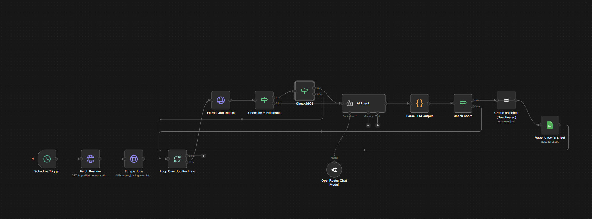

# LinkedIn Jobs Ingestion & Resume Matching Pipeline

This project implements an automated pipeline to ingest LinkedIn job postings using the LinkedIn Jobs API, filter and evaluate them against an existing resume, enhance the resume content using an LLM, and generate a tailored PDF via the Overleaf API.

The system is designed as a modular, scheduled workflow that continuously scans for relevant jobs and produces resume variants optimized for each role.

---

## High-Level Overview

The pipeline performs the following steps:

1. Periodically fetches the latest LinkedIn job postings (can set the cron job interval)
2. Filters and normalizes job data
3. Compares job descriptions against the current resume
4. Uses an LLM agent to enhance resume content for strong matches
5. Generates a role-specific PDF via Overleaf
6. Persists results for tracking and auditing

---

## Architecture Flow

**Schedule Trigger**
  ↓
**Fetch Resume Content**
  ↓
**Scrape LinkedIn Jobs (API)**
  ↓
**Loop Over Job Postings**
  ↓
**Extract Job Details**
  ↓
**Check MOE (Match of Experience)**
  ↓
**AI Resume Enhancement**
  ↓
**Score & Filter**
  ↓
**Overleaf PDF Generation**
  ↓
**Persist Results**

---

## Step-by-Step Workflow

### 1. Scheduled Trigger

A cron-based scheduler initiates the workflow at fixed intervals (daily or hourly), ensuring fresh job ingestion without manual intervention.

---

### 2. Resume Fetching

The latest resume content is fetched from a centralized source (database, object storage, or document service).  
This serves as the baseline resume for all job comparisons.

---

### 3. LinkedIn Jobs Ingestion

Jobs are ingested using the LinkedIn Jobs API.

**Query parameters include:**
- Job title keywords
- Location
- Experience level
- Employment type

**Normalized fields:**
- Job ID
- Company
- Role title
- Location
- Full job description
- Required skills

---

### 4. Job Loop & Detail Extraction

Each job posting is processed individually:

- Full job descriptions are extracted and cleaned
- Boilerplate text is removed
- Skills and responsibilities are isolated

---

### 5. MOE (Match of Experience) Check

A lightweight heuristic filter is applied before invoking the LLM:

- Skill overlap with resume
- Experience range compatibility
- Role relevance

Low-relevance roles are discarded early to reduce LLM cost.

---

### 6. AI Resume Enhancement

For jobs passing the MOE threshold, an AI agent is invoked with:

- Job description
- Current resume content

The agent:
- Rewrites bullet points to align with job requirements
- Matches terminology used in the job description
- Preserves factual accuracy
- Optimizes phrasing for ATS systems

The output is a job-specific resume variant.

---

### 7. Scoring & Filtering

Each enhanced resume is scored based on:

- Keyword alignment
- Skill coverage
- Seniority match
- Overall role relevance

Only resumes above a configured score threshold proceed further.

---

### 8. Overleaf PDF Generation

Qualified resume variants are sent to the Overleaf API:

- Resume content is injected into a LaTeX template
- Ensures consistent formatting and ATS-safe layout
- Overleaf compiles the LaTeX into a PDF

---

### 9. Persistence & Tracking

Final outputs are persisted for traceability:

- Job metadata
- Match score
- Resume version
- Generated PDF reference

This enables review, auditing, and future optimization.

---

## Key Design Principles

- Cost-efficient LLM usage via early filtering
- Modular, replaceable components
- Scalable job ingestion
- Fully traceable decision flow
- ATS-optimized resume generation

---

## Future Enhancements

- Multi-resume support by role category
- Company-specific resume tuning
- Automated job application submission
- Recruiter feedback-driven learning loop
- Skill gap analysis and recommendations

